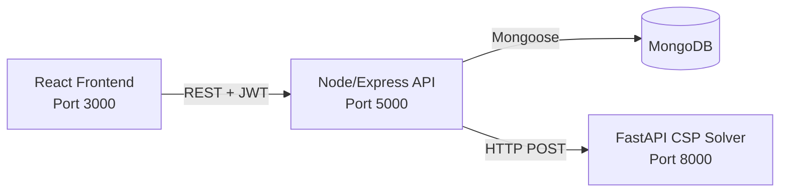

# Smart Scheduler — Final Year Project Report

> **Document Type:** Final Year Project (FYP) Report  
> **Project Category:** Web-based Academic Timetable Scheduling System (MERN + CSP Solver)  
> **Date:** 21 December 2025  

---

## Title Page

**Project Title:** Smart Scheduler  
**Subtitle:** A Role-Based Institute Management & Timetable Generation System using a Constraint Satisfaction Problem (CSP) Solver  

**Submitted By:** *(Student Name)*  
**Registration No.:** *(Reg. No.)*  
**Department:** *(Department)*  
**University/Institute:** *(University Name)*  

**Supervisor:** *(Supervisor Name)*  

---

## Declaration

I hereby declare that this project report is my original work and has not been submitted elsewhere for any academic award. All sources of information used in this report have been properly acknowledged.

**Student Name:** ____________________  
**Signature:** ____________________  
**Date:** ____________________

---

## Certificate / Approval

This is to certify that the project titled **“Smart Scheduler”** has been carried out by ***(Student Name)*** under my supervision and is accepted as a partial fulfillment of the requirements for the award of the degree.

**Supervisor:** ____________________  
**Signature:** ____________________  
**Date:** ____________________

---

## Acknowledgements

I would like to express my sincere gratitude to my supervisor ***(Supervisor Name)*** for continuous guidance, support, and constructive feedback throughout the project. I also thank my department and peers for their cooperation and motivation.

---

## Abstract

Academic timetable scheduling is a complex task due to multiple constraints such as room availability, instructor availability, class conflicts, lab duration requirements, and institutional working hours. Manual scheduling is time-consuming and error-prone. **Smart Scheduler** is a web-based scheduling and institute management system that supports multiple user roles (Owner, Admin, Teacher, Student) and automates timetable generation.

The project uses a **MERN stack** for the main application and a separate **FastAPI-based CSP solver** service for timetable generation. The solver models each required teaching session as a variable and assigns it a valid room-day-time combination under hard constraints (no overlaps, break-time compliance, lab consecutive slots) while optimizing soft preferences (spreading sessions across days, minimizing gaps, reducing back-to-back repetitions). The system generates **three candidate timetables** by running the solver with different random seeds, enabling administrators to choose the most suitable schedule.

---

## Table of Contents

1. Introduction  
2. Problem Statement and Objectives  
3. Literature Review  
4. System Analysis and Requirements  
5. System Design  
6. Implementation  
7. Testing and Validation  
8. Results and Discussion  
9. Deployment and User Guide  
10. Conclusion and Future Work  
11. References  
12. Appendices  

---

# Chapter 1 — Introduction

## 1.1 Background
Timetable creation for educational institutes must satisfy multiple overlapping constraints (teachers, rooms, class sections, lab duration, breaks, and available hours). As institute size grows, manual scheduling becomes increasingly difficult, often producing conflicts and requiring repeated adjustments.

## 1.2 Project Overview
**Smart Scheduler** is a role-based scheduling platform consisting of:
- A **React** web application (frontend)
- A **Node.js/Express** REST API (backend) connected to **MongoDB**
- A **Python FastAPI** microservice that generates timetables using a **CSP (Constraint Satisfaction Problem) solver**

The system provides institute onboarding (owner registration + institute registration), user management, core academic entities (rooms, classes, courses, time windows), feedback threads, subscription/payment handling, and timetable generation plus storage.

## 1.3 Scope
Included in scope:
- Multi-role authentication and authorization
- Institute configuration and management
- CRUD modules: rooms, classes, courses, time windows
- Timetable generation (CSP) and timetable storage
- Feedback threads between users and administrators
- Subscription gating and Stripe-based payments

Out of scope (not implemented in current codebase):
- Automatic instructor preference learning
- Real-time multi-user editing of timetables
- Advanced analytics beyond the existing dashboards

---

# Chapter 2 — Problem Statement and Objectives

## 2.1 Problem Statement
Educational institutes need a timetable generation method that is:
- Fast enough to generate schedules on demand
- Correct (conflict-free)
- Flexible (supports breaks, labs, varying lecture durations)
- Usable through a web UI for administrators

## 2.2 Objectives
Primary objectives:
- Build a complete institute management system with role-based access control
- Automate timetable generation using a CSP-based approach
- Provide multiple candidate timetables for selection
- Store and display generated timetables for admin/teacher/student views

Secondary objectives:
- Add subscription enforcement (Trial, Monthly, Yearly) with payment history
- Enable feedback/complaint threads for institute users

---

# Chapter 3 — Literature Review

## 3.1 Timetable Scheduling Approaches
Common approaches:
- Manual/Spreadsheet Scheduling
- Rule-based heuristics
- Metaheuristics (Genetic Algorithms, Simulated Annealing)
- Integer Programming (ILP)
- **Constraint Satisfaction Problems (CSP)**

## 3.2 Why CSP Fits This Project
CSP is suitable because:
- Scheduling constraints can be expressed as hard constraints
- Search + heuristics can efficiently find feasible schedules
- Soft constraints can be integrated as scoring preferences

## 3.3 CSP Heuristics Used
The solver uses standard CSP heuristics:
- **MRV (Minimum Remaining Values):** pick next variable with smallest domain
- **LCV (Least Constraining Value):** prefer assignments with lower soft-constraint penalty
- **Forward Checking:** prune domains of unassigned variables after each assignment
- **Time-bounded search:** avoids hanging by stopping after a maximum time budget per candidate

---

# Chapter 4 — System Analysis and Requirements

## 4.1 User Roles
The application supports four roles:
- **Owner:** registers institutes and manages institute-level business (e.g., payments overview)
- **Admin:** manages institute academic data and generates timetables
- **Teacher:** views timetables and uses feedback module
- **Student:** views timetables and uses feedback module

## 4.2 Functional Requirements
Core functional requirements implemented:
- User authentication (JWT) and role-based routing
- Owner registration + institute creation
- Admin: manage institute entities (rooms/classes/courses/time windows)
- Admin: generate timetables and save selected candidate
- Users: view timetables (role-specific views)
- Feedback threads and messages (user ↔ admin within institute)
- Subscription status endpoint and UI gating
- Stripe-based payment checkout and confirmation

## 4.3 Non-Functional Requirements
- Security: JWT authentication for protected APIs
- Reliability: MongoDB connection retry logic; CSP timeouts
- Usability: multi-step wizard for timetable generation (admin)
- Maintainability: modular route + model structure; Python solver isolated as service

---

# Chapter 5 — System Design

## 5.1 High-Level Architecture
The project uses a service-oriented layout:
- **Frontend (React)** communicates with **Backend (Express)**
- Backend communicates with **MongoDB** for persistence
- Backend calls **Python FastAPI** for timetable generation

### 5.1.1 Component Diagram (Logical)


## 5.2 Backend Design (Express)
Key backend modules:
- Auth and JWT token issuance
- CRUD modules: rooms, classes, courses, time slots
- Timetable generation orchestration (calls Python) and timetable persistence
- Feedback threads + message replies
- Subscription status and payment features (Stripe)

## 5.3 Database Design (MongoDB)
MongoDB stores institute and academic entities. Major collections include:
- `InstituteInformation` — institute metadata + subscription type
- `Users` and `OwnerUser` — role-based accounts
- `Room`, `Class`, `Course`, `TimeSlot`
- `InstituteTimeTables` and `InstituteTimeTableDetails` — saved timetables
- `InstituteSubscription` — payment records
- `Feedback` and `FeedBackMessages` — support/feedback module

### 5.3.1 Timetable Storage Strategy
A saved timetable is represented by:
- Header document (`InstituteTimeTables`) containing timetable id, session/year, visibility/currentStatus and optional break window
- Detail rows (`InstituteTimeTableDetails`) containing each scheduled session (room, class, course, day, time, instructor)

## 5.4 Frontend Design (React)
The frontend uses:
- `react-router-dom` for routing
- Route protection via `PrivateRoute` and role checks
- Subscription gating for institute roles (Admin/Teacher/Student)
- Bootstrap UI components and charts for dashboards

---

# Chapter 6 — Implementation

## 6.1 Technology Stack
- **Frontend:** React 18, React Router, Axios, Bootstrap, Chart.js
- **Backend:** Node.js, Express, Mongoose, JWT, Passport (Google OAuth), Nodemailer, Stripe
- **Database:** MongoDB (local or Atlas)
- **Scheduler Service:** Python 3 + FastAPI + Pydantic

## 6.2 Authentication and Authorization
- Backend issues JWT tokens with: user id, username, role/designation, and instituteID
- Frontend stores token in `localStorage` and sends it in `Authorization: Bearer <token>`
- Protected routes enforced in both backend middleware and frontend routing

## 6.3 Subscription Enforcement
- Endpoint `/api/subscription/status/:instituteID` calculates expiry:
  - Trial window (default 14 days)
  - Rolling Monthly/Yearly periods based on last payment
- Frontend `PrivateRoute` redirects expired users (unless explicitly allowed for profile pages)

## 6.4 Timetable Generation Flow (End-to-End)
1. Admin configures rooms, classes, courses, and institute daily time windows.
2. Admin runs a multi-step wizard to:
   - select rooms
   - map classes to class-rooms and lab-rooms
   - map courses per class
   - assign teachers per class-course
   - set break window and lecture duration (`slotMinutes`)
3. Frontend calls backend endpoint:
   - `POST /api/timetables-gen/generate`
4. Backend loads institute time windows from DB (`TimeSlot`), builds payload, and calls Python:
   - `POST http://<PY_API_URL>/timetables/generate`
5. Python generates **three candidates** using seeds 42, 1337, 2025.
6. Admin selects a candidate and saves it via:
   - `POST /api/timetables-gen/save`

## 6.5 CSP Solver Design (Python FastAPI)
### 6.5.1 CSP Modeling
- **Variables:** each required session for a (class, course)
  - Lecture variables: one per credit hour (e.g., 3 credit hours → 3 lecture sessions)
  - Lab variables: one variable representing a block of consecutive slots
- **Domains:** possible assignments for each variable:
  - `(room, day, time_slots)`
  - Lecture uses one slot; lab uses 3 consecutive slots (fallback to 2 if needed)

### 6.5.2 Hard Constraints (Must Satisfy)
- No room conflicts: same room cannot be used at overlapping times
- No class conflicts: class cannot have overlapping sessions
- No instructor conflicts: instructor cannot teach overlapping sessions
- Break respect: no session overlaps break window
- Lab consecutive scheduling: labs use consecutive slots

### 6.5.3 Soft Constraints (Preferences)
The solver assigns scores to candidate values to prefer:
- Avoid multiple sessions of the same course on the same day
- Spread sessions across days (avoid day overload)
- Avoid back-to-back same-course sessions
- Balance instructor workload
- Prefer middle time slots (between 9AM–5PM)
- Minimize large gaps in a class schedule
- Prefer matching room types (lab rooms for labs)

### 6.5.4 Search Strategy
- Backtracking search
- MRV variable ordering
- LCV via soft-constraint score ordering
- Forward checking to prune domains
- Time-bounded solving (default max 8 seconds per candidate)

---

# Chapter 7 — Testing and Validation

## 7.1 Testing Strategy
- Unit-level checks inside solver: constraint checks, overlap checks, domain generation
- Service-level checks: Python API returns 3 candidates or structured error messages
- API-level checks: backend validates assignment payload (credit hours etc.) and propagates solver errors

## 7.2 Python Solver Realistic Test
A realistic test script exists that builds multi-class workloads with labs and lectures and runs `generate_candidate` with a fixed seed. The test prints solver statistics (constraints checked, backtracks) and schedule distribution metrics.

## 7.3 Validation Criteria
A timetable is considered valid if:
- No overlaps for rooms, classes, or instructors
- Break time is respected
- Lecture duration respects `slotMinutes`
- Lab sessions are scheduled in consecutive blocks

---

# Chapter 8 — Results and Discussion

## 8.1 Output Candidates
The system produces **three candidate timetables** for the same input configuration by changing random seeds in the solver. This increases variety and helps administrators choose a schedule that best fits institutional preferences.

## 8.2 Performance Considerations
- Backend is lightweight; main compute is in Python solver
- Solver uses heuristics and a time limit to remain responsive

## 8.3 Strengths
- Clear separation: business app vs scheduling engine
- Constraint-based correctness
- Works with real institutional breaks and lab durations

## 8.4 Limitations
- Room type checking is flexible (labs can still be placed in non-lab rooms if needed)
- The system does not currently optimize for teacher preference beyond availability
- Large institutions may need higher solve time limits or additional heuristics

---

# Chapter 9 — Deployment and User Guide

## 9.1 Local Deployment (Development)
### Backend
- Location: `backend/`
- Start: `npm run dev` (port 5000)

### Frontend
- Location: `frontend/`
- Start: `npm start` (port 3000)
- Frontend uses proxy: `http://localhost:5000`

### Python Scheduler Service
- Location: `api/python/`
- Run: `uvicorn app:app --host 0.0.0.0 --port 8000`

## 9.2 Environment Variables (Typical)
Backend `.env` (examples):
- `MONGODB_URI`
- `JWT_SECRET`, `JWT_EXPIRE`
- `FRONTEND_URL`
- `SESSION_SECRET`
- `PY_API_URL` (defaults to `http://localhost:8000`)
- Stripe: `STRIPE_SECRET_KEY`, `STRIPE_WEBHOOK_SECRET`, `STRIPE_CURRENCY`

## 9.3 Admin Workflow (Timetable)
- Configure Rooms → Classes → Courses → Time Slots
- Generate Timetable → review candidate schedules → Save
- Publish visibility/current status using timetable header settings

---

# Chapter 10 — Conclusion and Future Work

## 10.1 Conclusion
Smart Scheduler demonstrates a practical and scalable approach to academic scheduling by combining a modern web application stack with a CSP-based scheduling engine. The system supports institute onboarding, academic configuration, user management, subscription enforcement, and automated timetable generation with multiple candidates.

## 10.2 Future Work
Potential improvements:
- Add stronger room-type enforcement or configurable strictness
- Add teacher availability calendars and preference ranking
- Add optimization objectives (e.g., minimize teacher idle time)
- Improve reporting/exports (PDF timetable, print-friendly view)
- Add administrative audit logs and role-based permissions granularity

---

# References

- MongoDB Documentation (Mongoose ODM usage)
- Express.js Documentation
- React Documentation
- FastAPI Documentation
- Stripe API Documentation
- Standard CSP literature (MRV, LCV, Forward Checking)

---

# Appendices

## Appendix A — Key API Endpoints (Backend)
- Auth: `/api/auth/*`
- Users: `/api/users/*`
- Rooms: `/api/rooms/*`
- Classes: `/api/classes/*`
- Courses: `/api/courses/*`
- Time Slots: `/api/timeslots/*`
- Timetable Generation: `/api/timetables-gen/*`
- Feedback: `/api/feedback/*`
- Subscription: `/api/subscription/*`
- Payments: `/api/payments/*`

## Appendix B — Python Scheduler Endpoint
- `POST /timetables/generate` → returns `{ candidates: [ {header, details, stats}, ... ] }`

## Appendix C — Data Model Summary (Core Fields)
- InstituteInformation: `instituteID`, `instituteName`, `address`, `contactNumber`, `subscription`, `instituteType`
- Users: `userName`, `email`, `designation`, `instituteID`
- Room: `roomNumber`, `roomStatus`, `instituteID`
- Course: `courseCode`, `courseTitle`, `courseType`, `creditHours`, `instituteID`
- Class: `degree`, `session`, `year`, `section`, `rank`, `instituteID`
- TimeSlot: `days`, `startTime`, `endTime`, `instituteID`

## Appendix D — Timetable Payload Structure (Simplified)
```json
{
  "instituteID": "...",
  "session": "Fall",
  "year": 2025,
  "classes": ["BS CS 1-A"],
  "assignments": [
    {"class": "BS CS 1-A", "course": "Data Structures", "type": "Lecture", "creditHours": 3, "instructor": "..."},
    {"class": "BS CS 1-A", "course": "DS Lab", "type": "Lab", "creditHours": 3, "instructor": "..."}
  ],
  "rooms": ["F101", "LabB101"],
  "roomTypes": {"F101": "Class", "LabB101": "Lab"},
  "timeslots": [{"day": "Mon", "start": "09:00", "end": "15:00"}],
  "breaks": {"mode": "same", "same": {"start": "12:00", "end": "12:30"}},
  "slotMinutes": 60,
  "algorithms": ["CSP"]
}
```
